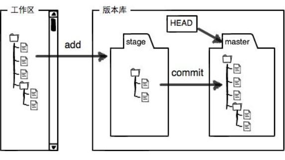
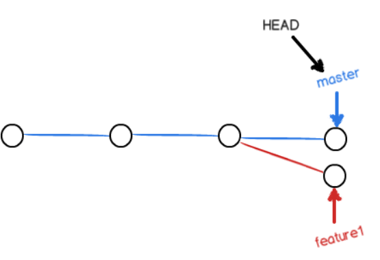
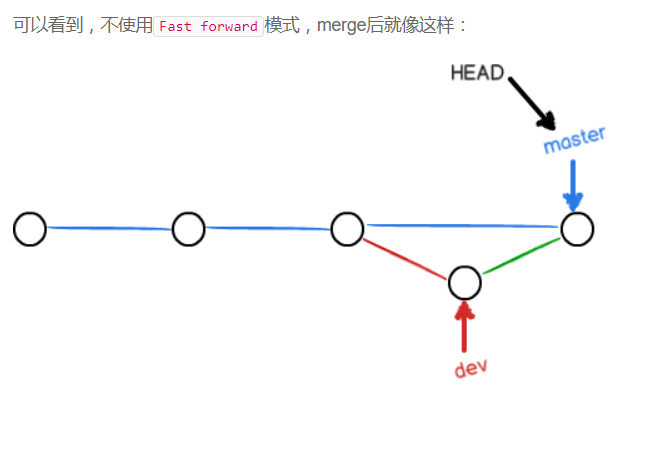

# git笔记
# git时光机
## 1.安装
**linux**

    $ git
    The program 'git' is currently not installed. You can install it by typing:
    sudo apt-get install git
**win**：需要去官网下载，然后在Git Bash  
安装完成，在命令行输入：

    $ git config --global user.name "Your Name"
    $ git config --global user.email "email@example.com"  
注意git config命令的--global参数，用了这个参数，表示你这台机器上所有的Git仓库都会使用这个配置，当然也可以对某个仓库指定不同的用户名和Email地址。

### 创建版本库:repository
在repositry里面，可以进行一系列操作（修改、删除...)，每个文件都会被管理。  
#### first（目录别中文）
    $ mkdir learngit
    $ cd learngit
    $ pwd
    /Users/michael/learngit  
#### second
    $ git init
    Initialized empty Git repository in /Users/michael/learngit/.git/ 
这个目录就编程了仓库（empty Git repository）  
如果没有看到.git目录，可能被隐藏，用命令：**ls -ah**  

---
## 2.命令
### 1.文件添加到repository
    $ git add readme.txt
    $ git add readme2.txt
    $ git commit -m "wrote a readme file"
文件添加一定在.git的目录or子目录  
可以一次添加多次，然后在commit  

### 2.更改状态查询
    1. $ git status #当前状态(modified, not add commit)
    2. $ git diff #

### 3.版本回退
    1. $ git log #修改历史
    2. $ git log --pretty=oneline #得到一行的版本号(**commit id**)
    3. $ git reset --hard HEAD^^ #HEAD表示当前版本
    4. $ git reset --hard HEAD~n #回退N个版本
    5. $ cat gitnote.md #显示文件内容
    6. $ git reset --hard 3628164 #依据版本号前几位回退
    7. $ git reflog #记录了每一次（历史）命令
    8. $ git diff    #是工作区(work dict)和暂存区(stage)的比较
    9. $ git diff --cached    #是暂存区(stage)和分支(master)的比较

## 3.工作区和暂存区
### Working Directory
文件夹learngit
### repository
工作区中的**.git**,这个不算工作区，是版本库(repository)  
.git存了很多东西:   
**stage(或者index)** 的暂存区。  
其中有自动创建作为第一个分区的**master**,以及指向master的第一个指针HEAD，如图：  
### 工作原理
第一步是用git add把文件添加进去，实际上就是把**文件修改**添加到**暂存区**；  
第二步是用git commit提交更改，实际上就是把暂存区的所有内容提交到**当前分支**。  
工作区的**修改**统统放到暂存区(add)， 然后在commit到分区.  

## 4.git管理的是修改，而非文件  
第一次修改 -> git add -> **第二次修改** -> git commit  
第二次修改不会被commit,因为没有add进暂存区
 
## 5.撤销修改
    $ git checkout -- readme.txt #放弃对工作区的修改
    $ git reset HEAD file #暂存区的修改撤销掉（unstage），重新放回工作区
文件已修改，未add到暂存区:  
git checkout -- file可还原  

文件已修改，并add到暂存区未commit：  
git read HEAD file  
git checkout -- file可还原  
git reset命令既可以回退版本，也可以把暂存区的修改回退到工作区。当我们用HEAD时，表示最新的版本。

## 6.删除文件
    $ rm test.txt #普通的删除文件（这个文件在版本库里面，即是被commit过）命令，或者直接删除
$ git status可以知道，删除这个**修改**操作没有commit/add，repository中还有数据。接下来，有两个选择：
1. 确实从版本库删除：  

    $ git rm test.txt  
    rm 'test.txt'  
    $ git commit -m "remove test.txt"  
    [master d17efd8] remove test.txt  
    1 file changed, 1 deletion(-)    
    delete mode 100644 test.txt  
2. 删除错误，需要恢复：  
  
    $ git checkout -- test.txt

**git checkout**其实是用版本库里的版本替换工作区的版本，无论工作区是修改还是删除，都可以“一键还原”。  
命令git rm用于删除一个文件。如果一个文件已经被提交到版本库，那么你永远不用担心误删，但是要小心，你只能恢复文件到最新版本，你会丢失最近一次提交后你修改的内容。  

## 小结：命令
    $ git config --global user.name "Your Name"
    $ git config --global user.email "email@example.com"  
    $ mkdir learngit
    $ cd learngit
    $ pwd
    $ git init
    $ git ls files #查看管理的文件
    $ git add readme.txt
    $ git add foldername/. #add指定folder的所以文件
    $ git commit -m "wrote a readme file"
    $ git status #当前状态(modified, not add commit)
    $ git diff    #是工作区(work dict)和暂存区(stage)的比较
    $ git diff --cached    #是暂存区(stage)和分支(master)的比较
    $ git log     #修改历史
    $ git log --pretty=oneline     #得到一行的版本号(**commit id**)
    $ git log --oneline
    $ git reset --hard HEAD^^     #HEAD表示当前版本
    $ git reset --hard HEAD~n     #回退N个版本
    $ git reset --hard 3628164     #依据版本号前几位回退
    $ cat gitnote.md     #显示文件内容
    $ git reflog     #记录了每一次（历史）命令
    $ git reset HEAD file     #暂存区的修改撤销掉（unstage），重新放回工作区
    $ git checkout -- readme.txt     #放弃对工作区的修改
    $ git checkout -- file可还原  
    $ rm test.txt 
    $ git rm test.txt    #需要commit才会放置到版本库
    $ git rm -rf filename     #remove filefolder
    $ git rm -r filename     #remove file in filefolder

# 远程仓库
## github
新的repository，然后又两个选项，粘贴下来，在本地库上输入命令：

    git remote add origin https://github.com/wujinggrt/learngit.git
    git push -u origin master
远程库名字叫origin（为了方便记忆，不应该改）。  
第一次推送到远程仓库，需要在push命令之后-u,之后就不用了，在本地修改完成后：

    $ git push origin master
可以完成。
## SSH警告
当你第一次使用Git的clone或者push命令连接GitHub时，会得到一个警告：

    The authenticity of host 'github.com (xx.xx.xx.xx)' can't be established.
    RSA key fingerprint is xx.xx.xx.xx.xx.
    Are you sure you want to continue connecting (yes/no)?
输入yes回车即可。  

    Warning: Permanently added 'github.com' (RSA) to the list of known hosts.
    
关联远方库：**git remote add origin git@server-name:path/repo-name.git**  
git push -u origin master第一次推送master分支的所有内容  
此后，每次本地提交后，只要有必要，就可以使用命令git push origin master推送最新修改；

## 从远程库克隆
    $ git clone git@github.com:michaelliao/gitskills.git #这个是作者的
    $ git clone https://github.com/wujinggrt/Leveling
    Cloning into 'Leveling'...
    remote: Counting objects: 3, done.
    remote: Compressing objects: 100% (2/2), done.
    Unpacking objects: 100% (3/3), done.
    remote: Total 3 (delta 0), reused 0 (delta 0), pack-reused 0
    Checking connectivity... done.
接下来，在工作区多了一个leveling目录

    lenovo@LAPTOP-R6DJ0KTO MINGW64 /f/Workspace/learngit (master)
    $ cd Leveling

    lenovo@LAPTOP-R6DJ0KTO MINGW64 /f/Workspace/learngit/Leveling (master)
    $ ls
    README.md
你也许还注意到，GitHub给出的地址不止一个，还可以用**https://github.com/michaelliao/gitskills.git** 这样的地址。实际上，Git支持多种协议，默认的git://使用ssh，但也可以使用https等其他协议。  
使用https除了速度慢以外，还有个最大的麻烦是每次推送都必须输入口令，但是在某些只开放http端口的公司内部就无法使用ssh协议而只能用https。  
Git支持多种协议，包括**https**，但通过**ssh**支持的原生**git**协议速度最快。

    $ git clone git@github.com:wujinggrt/Leveling.git
    Cloning into 'Leveling'...
    The authenticity of host 'github.com (192.30.255.113)' can't be established.
    RSA key fingerprint is SHA256:nThbg6kXUpJWGl7E1IGOCspRomTxdCARLviKw6E5SY8.
    Are you sure you want to continue connecting (yes/no)?

# 分支管理（branch）
## 创建与合并
首先，我们创建dev分支，然后切换到dev分支：

    $ git checkout -b dev
    Switched to a new branch 'dev'
git checkout命令加上-b参数表示创建并切换，相当于以下两条命令：

    $ git branch dev
    $ git checkout dev
    Switched to branch 'dev'
然后，用git branch命令查看当前分支，git branch命令会列出所有分支，当前分支前面会标一个*号：

    $ git branch
    * dev
    master 

    $ git add readme.txt 
    $ git commit -m "branch test"
    [dev fec145a] branch test
    1 file changed, 1 insertion(+)
dev分支的工作完成，我们就可以切换回master分支：

    $ git checkout master
    Switched to branch 'master'  
现在，我们把dev分支的工作成果合并到master分支上：

    $ git merge dev
    Updating d17efd8..fec145a
    Fast-forward
    readme.txt |    1 +
    1 file changed, 1 insertion(+)
Fast-forward信息，Git告诉我们，这次合并是“快进模式”，也就是直接把master指向dev的当前提交，所以合并速度非常快  
合并完成后，就可以放心地删除dev分支了：

    $ git branch -d dev
    Deleted branch dev (was fec145a).

### 小结
Git鼓励大量使用分支：

查看分支：git branch

创建分支：git branch <name>

切换分支：git checkout <name>

创建+切换分支：git checkout -b <name>

合并某分支到当前分支：git merge <name>

删除分支：git branch -d <name>  

## 解决冲突
两个分支，一前一后做出不同的修改：

    $ git checkout -b feature1
    $ git add readme.txt
    $ git commit -m "do something at feature branch"

    $ git checkout master
    $ git add readme.txt
    $ git commit -m "do something at master branch"
这种情况，无法快速合并, 

    $ git merge feature #failed
    $ git status #fail 之后可以查看到冲突信息
必须手动解决，git status可以帮助我们查看那些冲突。  
原文中有如下符号  
Git用 **<<<<<<<，=======，>>>>>>>** 标记出不同分支的内容，我们修改如下后保存：
用带参数的git log也可以看到分支的合并情况，  
冲突标记删掉，把冲突解决正确,只保留一个：  
Creating a new branch is quick and simple.

    $ git log --graph --pretty=oneline --abbrev-commit
    *   59bc1cb conflict fixed
    |\
    | * 75a857c AND simple
    * | 400b400 & simple
    |/
    * fec145a branch test
    ...  
知识解决了冲突，把信息不一样的地方搞定，但是在branch上的文本还是没有改变。
### 小结
用git log --graph命令可以看到分支合并图。

## 分支管理策略
Fast forward模式，但这种模式下，删除分支后，会 ***丢掉*** 分支信息。

    $ git merge --no-ff -m "merge with no-ff" dev

###小结
合并分支时，加上--no-ff参数就可以用普通模式合并，合并后的 ***历史有分支***，
能看出来曾经做过合并，而fast forward合并就看不出来曾经做过合并。

## Bug分支
每个bug都可以通过一个新的临时分支来修复，修复后，合并分支，然后将临时分支删除。    
Git还提供了一个stash功能，可以把当前工作现场 ***“储藏”*** 起来，等以后恢复现场后继续工作：

    $ git stash
然后在stash临时工作，直到完成后，需要恢复之前的工作区:

    $ git stash list #查看之前工作现场
恢复两个办法：

    #第一种
    $ git stash apply #恢复后，stash内容并不删除,需要drop
    $ git stash drop

    #第二种
    ￥ git stash pop #恢复并且删除stash内容
你可以多次stash，恢复的时候，先用git stash list查看，然后恢复指定的stash，用命令：

    $ git stash apply stash@{0}

## Feature分支
    $ git branch -d feature-vulcan
    error: The branch 'feature-vulcan' is not fully merged.
    If you are sure you want to delete it, run 'git branch -D feature-vulcan'.
没有合并过的分支强行删除：

    $ git branch -D feature-vulcan
    Deleted branch feature-vulcan (was 756d4af).

## 多人协作
### 推送分支
查看远程库信息,远程仓库的默认名称是origin:

    $ git remote
    origin
或者，用git remote -v显示更详细的信息：

    $ git remote -v
    origin  git@github.com:michaelliao/learngit.git (fetch)
    origin  git@github.com:michaelliao/learngit.git (push)

推送分支，就是把该分支上的所有本地提交推送到远程库。推送时，要指定本地分支，这样，Git就会把该分支推送到远程库对应的远程分支上：

    $ git push origin master
如果要推送其他分支，比如dev，就改成：

    $ git push origin dev
但是，并不是一定要把本地分支往远程推送，那么，哪些分支需要推送，哪些不需要呢？

* master分支是主分支，因此要时刻与远程同步；
* dev分支是开发分支，团队所有成员都需要在上面工作，所以也需要与远程同步；
* bug分支只用于在本地修复bug，就没必要推到远程了，除非老板要看看你每周到底修复了几个bug；  
* feature分支是否推到远程，取决于你是否和你的小伙伴合作在上面开发。  
 
 总之，就是在Git中，分支完全可以在本地自己藏着玩，是否推送，视你的心情而定！

 ### 抓取分支
    $ git checkout -b dev origin/dev     #checkout远程的dev分支，本地起名dev分支，并切换到本地的dev分支
当有两个人（or more）都push dev，会存在冲突，从而有一个push失败。

先用**git pull**把最新的提交从**origin/dev**抓下来，然后，在本地合并，解决冲突，再推送：  

git pull也失败了，原因是没有指定本地dev分支与远程origin/dev分支的链接，根据提示，设置dev和origin/dev的链接：

    $ git branch --set-upstream dev origin/dev
    Branch dev set up to track remote branch dev from origin.
再pull：

    $ git pull
    Auto-merging hello.py
    CONFLICT (content): Merge conflict in hello.py
    Automatic merge failed; fix conflicts and then commit the result.
这回git pull成功，但是合并有冲突，需要手动解决，解决的方法和分支管理中的解决冲突完全一样。解决后，提交，再push：

    $ git commit -m "merge & fix hello.py"
    [dev adca45d] merge & fix hello.py
    $ git push origin dev
    Counting objects: 10, done.
    Delta compression using up to 4 threads.
    Compressing objects: 100% (5/5), done.
    Writing objects: 100% (6/6), 747 bytes, done.
    Total 6 (delta 0), reused 0 (delta 0)
    To git@github.com:michaelliao/learngit.git
    291bea8..adca45d  dev -> dev

### 小结小结
* 查看远程库信息，使用git remote -v；
* 本地新建的分支如果不推送到远程，对其他人就是不可见的；
* 从本地推送分支，使用git push origin branch-name，如果推送失败，先用git pull抓取远程的新提交；
* 在本地创建和远程分支对应的分支，使用git checkout -b branch-name origin/branch-name，本地和远程分支的名称最好一致；
* 建立本地分支和远程分支的关联，使用git branch --set-upstream branch-name origin/branch-name；
* 从远程抓取分支，使用git pull，如果有冲突，要先处理冲突。

# 标签管理
## 创建标签
在Git中打标签非常简单，首先，切换到需要打标签的分支上：

    $ git branch
    * dev
    master
    $ git checkout master
    Switched to branch 'master'
然后，敲命令git tag <name>就可以打一个新标签：

    $ git tag v1.0
可以用命令git tag查看所有标签：

    $ git tag
    v1.0
默认标签是打在最新提交的commit上的。有时候，如果忘了打标签，比如，现在已经是周五了，但应该在周一打的标签没有打，怎么办？

方法是找到历史提交的commit id，然后打上就可以了：

    $ git log --pretty=oneline --abbrev-commit
    6a5819e merged bug fix 101
    cc17032 fix bug 101
    7825a50 merge with no-ff
    6224937 add merge
    59bc1cb conflict fixed
    400b400 & simple
    75a857c AND simple
    fec145a branch test
    d17efd8 remove test.txt
    ...
比方说要对add merge这次提交打标签，它对应的commit id是6224937，敲入命令：

    $ git tag v0.9 6224937
注意，标签不是按时间顺序列出，而是按字母排序的。可以用git show <tagname>查看标签信息：

    $ git show v0.9
    commit 622493706ab447b6bb37e4e2a2f276a20fed2ab4
    Author: Michael Liao <askxuefeng@gmail.com>
    Date:   Thu Aug 22 11:22:08 2013 +0800

        add merge
    ...

还可以创建带有说明的标签，用-a指定标签名，-m指定说明文字：

    $ git tag -a v0.1 -m "version 0.1 released" 3628164
还可以通过-s用私钥签名一个标签：

    $ git tag -s v0.2 -m "signed version 0.2 released" fec145a

### 小结
* 命令git tag <name>用于新建一个标签，默认为HEAD，也可以指定一个commit id；
* git tag -a <tagname> -m "blablabla..."可以指定标签信息；
* git tag -s <tagname> -m "blablabla..."可以用PGP签名标签；
* 命令git tag可以查看所有标签。

## 操作标签
    $ git tag -d v0.1
    Deleted tag 'v0.1' (was e078af9)
如果要推送某个标签到远程，使用命令git push origin <tagname>：

    $ git push origin v1.0
    Total 0 (delta 0), reused 0 (delta 0)
    To git@github.com:michaelliao/learngit.git
    * [new tag]         v1.0 -> v1.0
如果标签已经推送到远程，要删除远程标签就麻烦一点，先从本地删除：

    $ git tag -d v0.9
    Deleted tag 'v0.9' (was 6224937)
    然后，从远程删除。删除命令也是push，但是格式如下：

    $ git push origin :refs/tags/v0.9
    To git@github.com:michaelliao/learngit.git
    - [deleted]         v0.9

## 小结
* 命令git push origin <tagname>可以推送一个本地标签；
* 命令git push origin --tags可以推送全部未推送过的本地标签；
* 命令git tag -d <tagname>可以删除一个本地标签；
* 命令git push origin :refs/tags/<tagname>可以删除一个远程标签.
